# [Movie Application](https://movie.ledangminh.id.vn)

## Mục tiêu

Project này hướng đến việc xây dựng một website xem phim tập trung vào phần giao diện người dùng và thiết kế hệ thống đáp ứng được khả năng về hiệu suất và khả năng mở rộng.

## Công nghệ sử dụng
- Front-end: Reactjs, Redux thunk
- Back-end: Nestjs, Docker
- Database: Mysql
- Message broker: RabbitMQ

## Phân tích hệ thống

### Vấn đề trải nghiệm người dùng

Để cải thiện trải nghiệm người dùng, lựa chọn giải pháp CSR (Client-side rendering) là thích hợp hơn so với SSR (Server-side rendering). Với CSR, trang web sẽ không cần phải tải lại, điều này giúp người dùng tránh khỏi trải nghiệm không mong muốn khi giao tiếp với trang web, vì không có hiện tượng nhấp nháy do quá trình tải lại trang. Xét đến các library/framework về CSR:

- ReactJS và Angular đều là các framework phổ biến với cộng đồng lớn.Tuy nhiên, project này sẽ sử dụng ReactJS vì lý do đơn giản: Angular thường được đánh giá là phức tạp hơn React. Ngoài ra, về vấn đề hiệu suất, React được đánh giá cao hơn nhiều so với Angular.

- Javascript và Typescript: Javascript là ngôn ngữ động, tức là các biến được biên dịch trong thời gian thực thi (runtime). Điều này có thể dẫn đến việc crash hệ thống khi không được code kĩ càng. Vấn đề này được cải thiện với Typescript, với các chức năng strong typing, object-oriented,... tuy gây khó khăn khi implement, nhưng lại dễ dàng trong việc bảo trì và phát triển trong các dự án lớn.

### Vấn đề hiệu suất và khả năng mở rộng

Hiện nay có 2 dạng kiến trúc thường được sử dụng: Monolith architecture và Microservice architecture:

- Kiến trúc Monolith (nguyên khối): tất cả các thành phần được đặt chung với nhau, có thể được phân lớp theo các tầng logic. Tuy nhiên, điểm yếu lớn của kiến trúc này là không thể mở rộng hiệu suất và khả năng sẵn có rất thấp. Nếu một thành phần gặp sự cố, toàn bộ hệ thống sẽ ảnh hưởng.
  

  

- Kiến trúc Microservice: dạng kiến trúc này thường chia nhỏ các component ra từng thành phần khác nhau và được đặt riêng biệt ở những nơi khác nhau, chúng liên kết với nhau thông qua các giao thức mạng như: rest api, grpc,...Việc chia nhỏ thành từng service sẽ hạn chế khả năng crash toàn hệ thống và đáp ứng được khả năng mở rộng khi có nhu cầu

  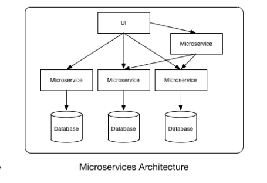

Ta nhận thấy rằng các đặc tính trên khắc phục được hoàn toàn yếu tố  khả năng scale và tính sẵn có, hoàn toàn đáp đáp ứng cho vấn đề của chúng ta. 

### Vấn đề giao tiếp giữa các service
Trong kiến trúc microservices, một request có thể được một hoặc nhiều service cùng nhau để xử lý, ta có thể lấy ví dụ sau:

  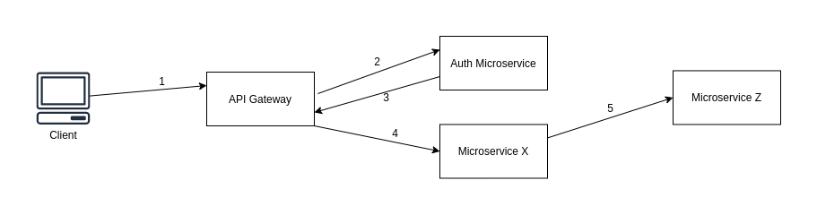

Trong ví dụ trên, API Gateway đóng vai trò trung gian. Khi có một request đến, đầu tiên, API Gateway sẽ giao tiếp với Auth service để xác thực user, nếu user hợp lệ thì gateway sẽ tiếp tục gọi đến các service liên quan để hoàn thành request.

Để các service có thể giao tiếp được với nhau thì có nhiều cách tiếp cận. Các service có thể đóng vai trò là các http server và giao tiếp với nhau thông qua api.

  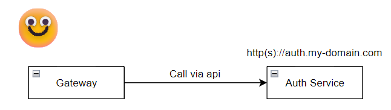

Tuy nhiên, khi hệ thống chúng ta mở rộng, các service (các http server) ngày càng tăng lên. Ta cũng cần load balancer để phân tán request cho các service làm cho chi phí duy trì hệ thống tăng cao

  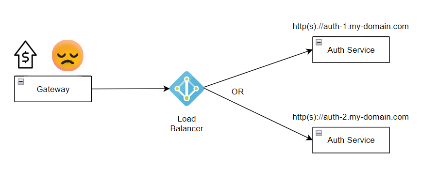

Một cách tiếp cận khác là các service giao tiếp với nhau qua Message broker, một module trung gian trung chuyển message giữa các service. Giờ đây, các service không nhất thiết là các http server nữa, mà có thể là các container, các máy ảo hoặc thậm chí là các máy tính cá nhân. Việc giao tiếp giữa các service giờ đây đã có Message broker lo. 

  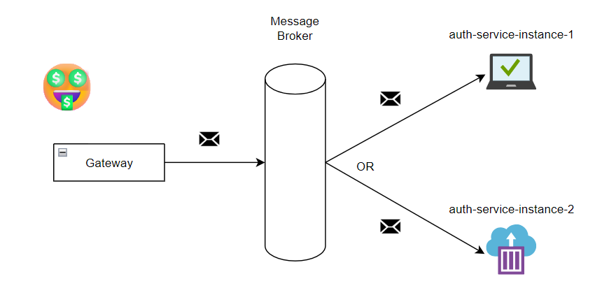

### Vấn đề về độ trễ
Trong kiến trúc microsẻrvice, việc các service giao tiếp với nhau thông qua các giao thức mạng sẽ gây nên vấn đề về độ trễ, vì vậy ta sẽ thêm caching service vào hệ thống. Data chủ yếu của hệ thống xem phim là những bộ phim, và những data đó không thường xuyên cập nhật, do đó chúng ta có thể cache những data đó, do bản chất cache là in-memory, nên khả năng đọc sẽ tốt hơn so với database.

  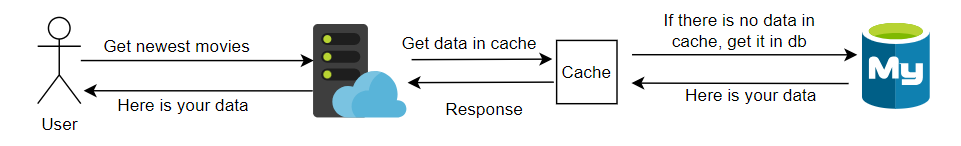

## Kiến trúc hệ thống
Sau khi liệt kê và giải quyết các vấn đề ở trên, hệ thống của chúng ta sẽ bao gồm những thành phần sau:
* Web frontend: chịu trách nhiệm hiển thị và tương tác giữa người dùng với hệ thống backend.
* API gateway: Tiếp nhận các http request, đẩy cho các service xử lý thông qua Message broker, tiếp nhận phản hồi và trả về kết quả cho client.
* Message broker: RabbitMQ chạy trên cloud, tiếp nhận và điều hướng message.
* Redis: Đóng vai trò là caching service.
* Hệ thống các service, chạy trên máy ảo Google Compute:
  - Auth service: Chịu trách nhiệm xác thực/ủy quyền người dùng.
  - User service: Chịu trách nhiệm xử lý các tác vụ liên quan đến thông tin user.
  - Movie service: Chịu trách nhiệm xử lý các tác vụ liên quan đến thông tin các bộ phim.
  - Recommendation service: Chịu trách nhiệm gợi ý phim.

  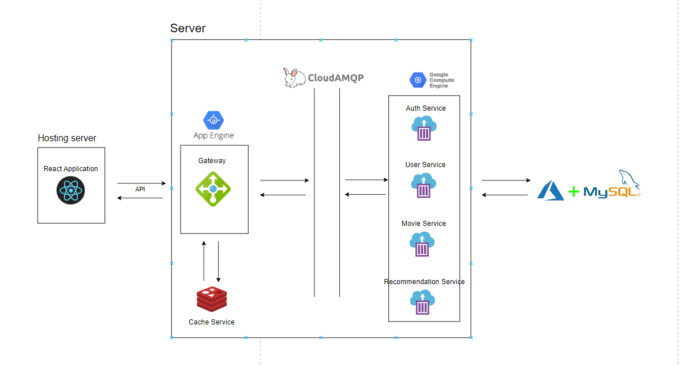

## Hiện thực

  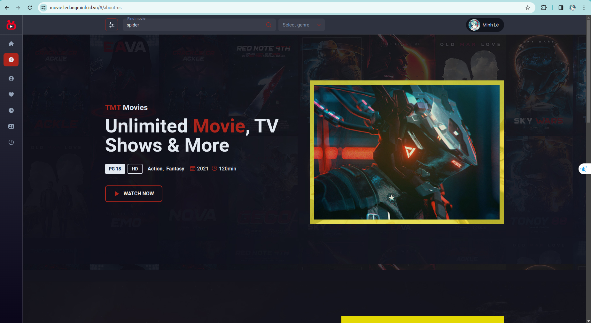

<h4 align="center">Trang about us</h4>

  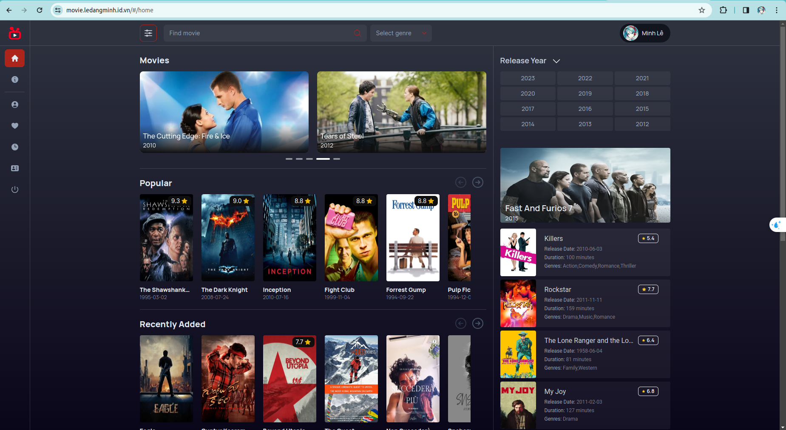

<h4 align="center">Trang chủ</h4>

  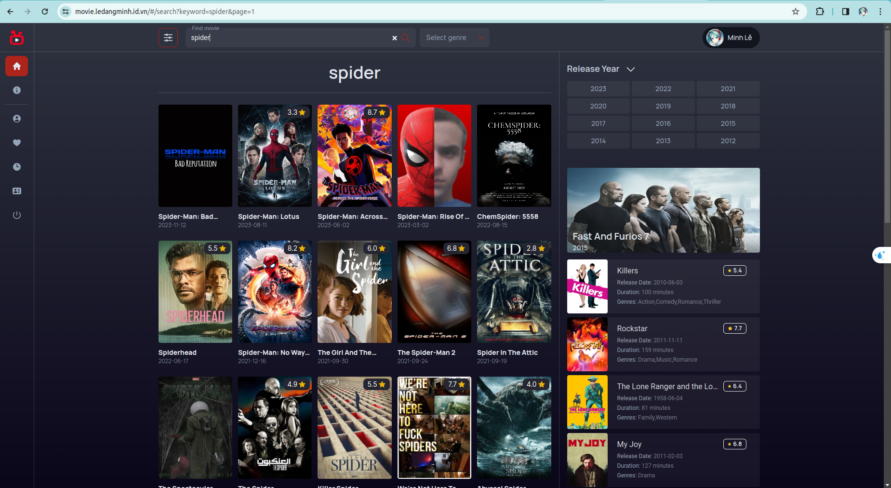

<h4 align="center">Trang tìm kiếm phim</h4>

  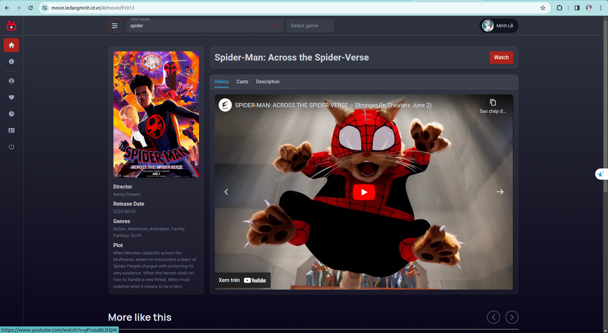

<h4 align="center">Trang chi tiết phim</h4>

  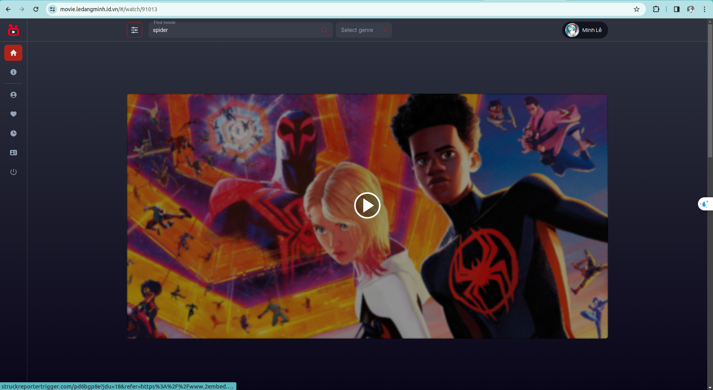

<h4 align="center">Trang xem phim</h4>

  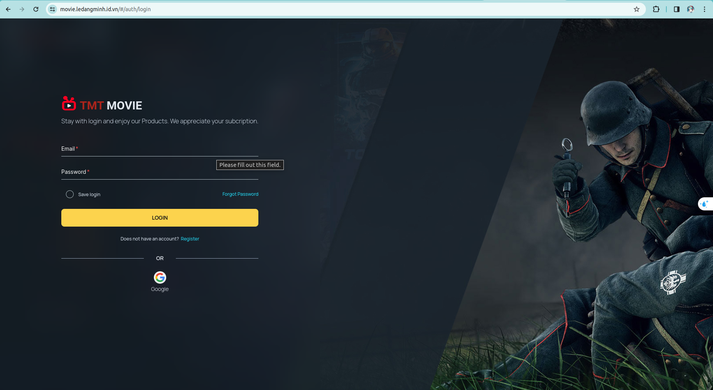

<h4 align="center">Trang đăng nhập</h4>

  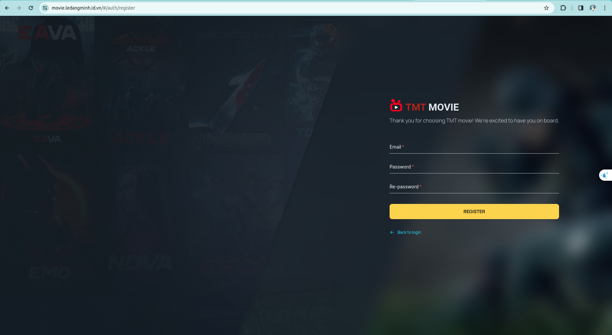

<h4 align="center">Trang đăng kí</h4>

  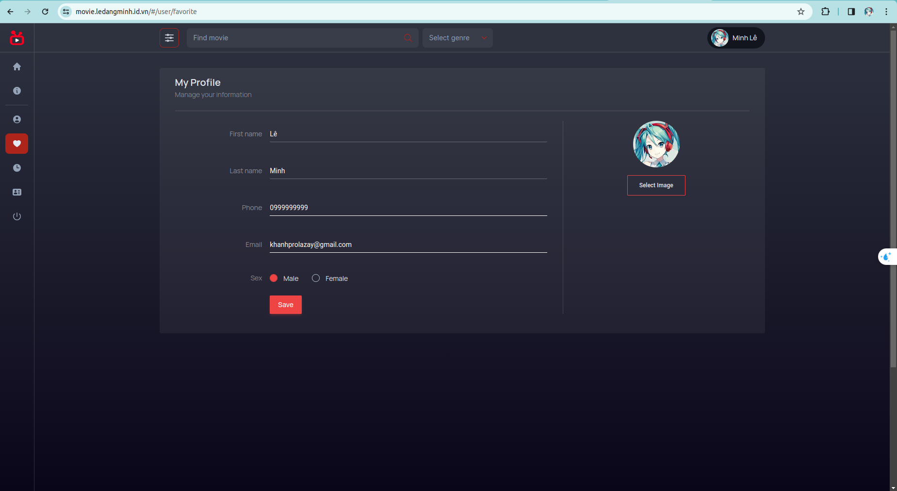

<h4 align="center">Trang quản lý thông tin cá nhân</h4>

## Note
Vì lí do kinh phí, website sẽ open đến hết tháng 1 năm 2024. Sau thời gian này hệ thống backend sẽ không phản hồi.
